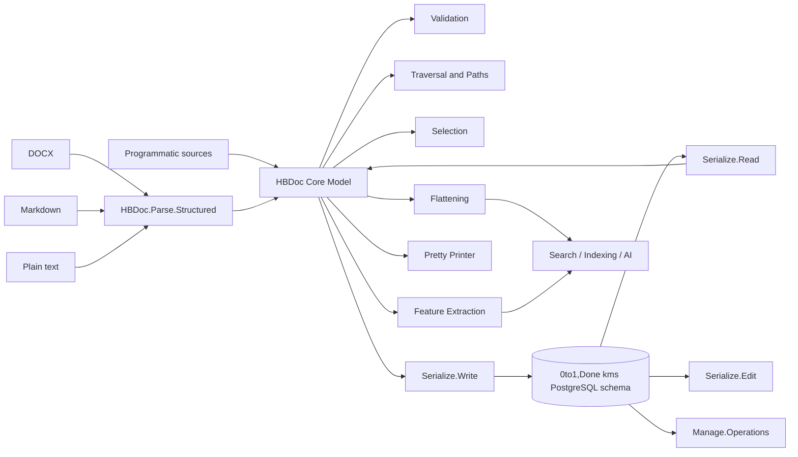

# HBDoc

**A canonical hierarchical document model, parser, analysis toolkit, and
persistence layer for the 0to1,Done knowledge-management system.**

HBDoc provides a common representation for documents that originate in
different formats but need to be processed uniformly by the 0to1,Done
ecosystem.

Instead of allowing every importer, analyser, AI process, search component,
and database operation to develop its own interpretation of document
structure, HBDoc converts content into a typed hierarchical block tree.

That tree can then be:

- validated against structural invariants;
- traversed and queried by canonical paths;
- flattened into text for search, indexing, and AI processing;
- transformed into block- and document-level analytical features;
- annotated with source and inference provenance;
- persisted into the 0to1,Done PostgreSQL knowledge-management schema;
- reconstructed from current or historical database state; and
- structurally edited while preserving database identity.

HBDoc is a **Haskell library**, not a standalone application or server.

The repository contains the second-generation HBDoc design ("HBDoc v2").
The current Haskell package version is `0.2.0.0`.

---

## Contents

- [Role in 0to1,Done](#role-in-0to1done)
- [Why HBDoc exists](#why-hbdoc-exists)
- [Architecture](#architecture)
- [The canonical document model](#the-canonical-document-model)
- [Block kinds](#block-kinds)
- [Semantics, attributes, and provenance](#semantics-attributes-and-provenance)
- [Getting started](#getting-started)
- [Parsing documents](#parsing-documents)
- [Building documents programmatically](#building-documents-programmatically)
- [Validation](#validation)
- [Traversal and paths](#traversal-and-paths)
- [Selecting document structure](#selecting-document-structure)
- [Flattening documents](#flattening-documents)
- [Feature extraction](#feature-extraction)
- [PostgreSQL persistence](#postgresql-persistence)
- [Database editing](#database-editing)
- [Document-management operations](#document-management-operations)
- [Pretty-printing and diagnostics](#pretty-printing-and-diagnostics)
- [Module map](#module-map)
- [Design characteristics](#design-characteristics)
- [Current status and known limitations](#current-status-and-known-limitations)
- [Development](#development)
- [Repository housekeeping](#repository-housekeeping)
- [License](#license)

---

## Role in 0to1,Done

0to1,Done needs to ingest and reason about information originating from
heterogeneous sources.

A DOCX file, Markdown document, plain-text specification, imported
conversation, or manually generated document may express similar logical
structure in very different source representations.

HBDoc provides the normalization boundary between those source formats and
the rest of the system.

Conceptually:

```text
source document
      |
      v
format-specific ingestion
      |
      v
+-------------------------+
|      HBDoc tree         |
|                         |
| structure               |
| semantics               |
| attributes              |
| provenance              |
+-------------------------+
      |
      +------> validation
      |
      +------> traversal / selection
      |
      +------> search and indexing text
      |
      +------> analytical features
      |
      +------> AI processing
      |
      +------> PostgreSQL persistence
      |
      +------> structural editing
```

This keeps source-format concerns near the ingestion boundary while allowing
downstream 0to1,Done components to operate on one shared structural model.

---

## Why HBDoc exists

A document is more than a sequence of strings.

For example, the following pieces of information can matter independently:

- a paragraph's visible text;
- whether a node is a heading, list item, table cell, message, or note;
- the level of a heading;
- whether a list is ordered, bulleted, an outline, or a definition list;
- whether numbering came directly from the source or was inferred;
- the structural ancestry of a paragraph;
- DOCX style and numbering information;
- media references;
- the original source of a reconstructed structure;
- the confidence associated with an inference; and
- the persistent identity of a block stored in the knowledge base.

Flattening all of that information into plain text during ingestion loses
information that later stages may need.

Keeping every source format's native representation, on the other hand,
forces every downstream component to understand every input format.

HBDoc therefore uses an intermediate representation:

> preserve useful document structure in a source-independent model, while
> retaining enough attributes and provenance to understand where that
> structure came from.

Pandoc is used as an important ingestion mechanism, but the HBDoc tree is
the long-lived application model used by 0to1,Done.

---

## Architecture



The design is divided into several layers:

| Layer | Responsibility |
| --- | --- |
| `HBDoc.Core` | Canonical document and block representation |
| `HBDoc.Parse` | Conversion of external formats into HBDoc |
| `HBDoc.Analysis` | Paths, traversal, selection, flattening, and features |
| `HBDoc.Render` | Human-readable diagnostic rendering |
| `HBDoc.Serialize` | PostgreSQL read/write/edit integration |
| `HBDoc.Manage` | Higher-level knowledge-management database operations |

---

## The canonical document model

At the highest level an HBDoc contains:

```text
HBDoc
 |
 +-- title
 +-- optional source format
 +-- document metadata
 +-- document-specific extra data
 |
 `-- root block
       |
       `-- children...
```

The root is expected to be a `ContainerKB`.

Each block contains six conceptually distinct forms of information:

```text
Block
 |
 +-- kind
 +-- optional visible content
 +-- optional typed semantics
 +-- non-semantic/source attributes
 +-- optional provenance
 +-- child blocks
 `-- application-specific extra data
```

Two type parameters allow applications to attach their own information to
the document and individual blocks:

```haskell
HBDoc docSpec blkSpec
Block blkSpec
```

For an ordinary in-memory document, both can simply be `()`.

For a document reconstructed from PostgreSQL, HBDoc uses database-specific
payloads containing such information as document IDs, block IDs, sequence
positions, and version information.

This makes the canonical structure reusable without mixing storage identity
into the basic document model.

---

## Block kinds

`KindBlk` describes the broad structural role of a block.

The current model supports:

| Kind | Purpose |
| --- | --- |
| `ContainerKB` | Generic/root container |
| `HeadingKB` | Heading |
| `ParagraphKB` | Paragraph |
| `ListKB` | List container |
| `ListItemKB` | List item |
| `QuoteKB` | Quoted block |
| `CodeKB` | Code block |
| `TableKB` | Table |
| `TableRowKB` | Table row |
| `TableCellKB` | Table cell |
| `FigureKB` | Figure |
| `ImageKB` | Image |
| `RuleKB` | Horizontal rule |
| `NoteKB` | Footnote or endnote |
| `ConversationKB` | Conversation/thread container |
| `MessageKB` | One conversation message |
| `CustomKB` | Extensible application-specific block |

An important design rule is that structural classification and detailed
semantics are separate.

For example:

```text
HeadingKB
    +
HeadingSemantics
    |
    +-- heading level
    +-- optional parsed label
    `-- heading source
```

The heading level is therefore not encoded by inventing kinds such as
`Heading1KB`, `Heading2KB`, and so on.

The same principle applies to lists, notes, tables, code, messages, and
other structured blocks.

---

## Semantics, attributes, and provenance

### Typed semantics

Blocks that require semantic information use variants of `SemanticsBlk`.

Examples include:

- heading level, label, and origin;
- list type and list-source information;
- list-item markers and inferred presentation;
- code language and info string;
- table caption and header-row information;
- table-cell row/column spans;
- image alternative text;
- figure captions;
- footnote/endnote identity;
- conversation thread identity;
- message role, author, and timestamp; and
- extensible custom semantic fields.

This keeps semantic information typed rather than embedding it into
unstructured attribute maps.

### Source and rendering attributes

`AttributesBlk` holds information useful for source fidelity, rendering, or
format-specific processing rather than semantic interpretation.

It currently includes support for:

```text
style information
numbering information
media references
note references
HTML IDs/classes/attributes
captions
custom attributes
```

This separation is intentional.

For example, DOCX numbering metadata can be preserved without making the
DOCX numbering implementation part of the canonical meaning of a list.

### Provenance

A block can also contain a `ProvenanceBlk`.

Provenance records:

```text
structure source
source reference
optional inference kind
optional confidence
```

Known source categories include Pandoc, DOCX XML, Markdown, Notion,
conversations, structured documents, manual edits, and extensible
application-defined sources.

Inference kinds currently include such operations as:

```text
list reconstruction
heading promotion
heading-label parsing
list continuation
structure normalization
```

This is particularly useful when importing imperfect documents.

A downstream process can distinguish:

```text
"the source document explicitly contained this structure"
```

from:

```text
"HBDoc inferred this structure while normalizing the document"
```

rather than silently treating the two as equivalent.

---

## Getting started

### Requirements

The repository currently uses:

```text
Stack snapshot: LTS 22.44
GHC:            9.6.7
Package:        hbdoc-0.2.0.0
```

`stack.yaml` enables `system-ghc`, so a compatible locally installed GHC can
be used.

Important dependencies include:

- Pandoc and `pandoc-types`;
- Aeson;
- Megaparsec;
- Hasql, Hasql TH, Hasql Pool, and Hasql Transaction;
- PostgreSQL binary support;
- `xml-conduit` and `zip-archive`;
- UUID support; and
- standard Haskell text/container packages.

### Clone and build

Using SSH:

```bash
git clone git@github.com:whatsupfudd/01_HBDoc.git
cd 01_HBDoc

stack build
```

Start an interactive session with:

```bash
stack ghci
```

HBDoc currently defines a library only; there is no standalone HBDoc
executable.

### Using HBDoc from another local Stack project

A neighbouring FUDD project can include HBDoc as a local package:

```yaml
packages:
- .
- ../01_HBDoc
```

and then depend on:

```yaml
dependencies:
- hbdoc
```

The exact layout naturally depends on the containing FUDD workspace.

---

## Parsing documents

The main ingestion module is:

```haskell
HBDoc.Parse.Structured
```

The simplest entry point is:

```haskell
parse :: FilePath -> IO (Either String Doc0)
```

where the current parser dispatches according to the filename extension.

| Input | Entry point | Processing |
| --- | --- | --- |
| `.docx` | `parseDocxFile` | Pandoc DOCX reader followed by HBDoc conversion |
| `.md` | `parseMarkdownFile` | Pandoc Markdown reader followed by HBDoc conversion |
| `.txt` | `parsePlainTextFile` | Text parser and structural reconstruction |
| no extension | `parsePlainTextFile` | Treated as plain text |
| other extension | `parsePlainTextFile` | Currently falls back to plain text |

Byte-oriented entry points are also provided for DOCX and Markdown:

```haskell
parseDocxBytes
parseMarkdownBytes
```

and an already-parsed Pandoc value can be converted through:

```haskell
parsePandocDoc
```

### Minimal parsing example

```haskell
import qualified Data.Text.IO as T

import HBDoc.Parse.Structured
import HBDoc.Render.PrettyPrint

main :: IO ()
main = do
  result <- parse "example.docx"
  T.putStrLn (prettyParseResultText result)
```

A successfully parsed document is validated before being returned.

A structural validation failure therefore becomes a parsing failure rather
than allowing an invalid canonical tree to propagate silently.

### Structural reconstruction

The structured parser does more than translate one source AST node into one
HBDoc node.

It also contains logic for reconstructing document structure from textual
presentation, including recognition of outline/list labels and inferred
nesting.

Examples of representations HBDoc is designed to reason about include:

```text
1. Introduction

1.1 Scope

a) First item

b) Second item

IV. Other considerations
```

Labels can be decomposed into typed atoms such as decimal, alphabetic, and
Roman components.

The resulting list/heading semantics can record both the parsed marker and
whether the structure was native or inferred.

That distinction is important for later document analysis.

---

## Building documents programmatically

Documents do not have to come through a parser.

`HBDoc.Core.Build` provides constructors for all canonical block kinds.

A small document can be built directly:

```haskell
{-# LANGUAGE OverloadedStrings #-}

import HBDoc.Core.Build
import HBDoc.Core.ListSemantics
import HBDoc.Core.Types

exampleDoc :: HBDoc () ()
exampleDoc =
  mkHBDocSimple
    ()
    "Example document"
    (Just "manual")
    (mkContainer0
      [ mkHeading0
          "Overview"
          (HeadingSemantics 1 Nothing NativeHeadingHS)
          []
      , mkParagraph0
          (Just "This paragraph belongs to the document.")
      ])
```

The `...0` constructor family is a convenience layer for documents whose
extra payload type is `()`.

The more general constructors accept caller-defined `blkSpec` payloads.

Examples include:

```text
mkContainerBk
mkParagraphBk
mkHeadingBk
mkListBk
mkListItemBk
mkQuoteBk
mkCodeBk
mkTableBk
mkTableRowBk
mkTableCellBk
mkFigureBk
mkImageBk
mkRuleBk
mkNoteBk
mkConversationBk
mkMessageBk
mkCustomBk
```

Existing blocks can also be updated functionally using helpers for:

```text
attributes
provenance
children
content
extra payload
```

---

## Validation

`HBDoc.Core.Validate` defines the canonical structural checks.

Use:

```haskell
validateHBDoc
```

to obtain all issues, or:

```haskell
isValidHBDoc
```

for a simple validity result.

Validation distinguishes:

```text
ErrorVL
WarningVL
```

Each issue contains:

```text
severity
canonical block path
optional block kind
human-readable message
```

### Examples of enforced invariants

The root block must be a container.

Semantic payloads must agree with block kinds. For example:

```text
HeadingKB       <-> HeadingSB
ListKB          <-> ListSB
ListItemKB      <-> ListItemSB
CodeKB          <-> CodeSB
TableKB         <-> TableSB
TableCellKB     <-> TableCellSB
ConversationKB <-> ConversationSB
MessageKB       <-> MessageSB
```

Structural constraints include:

```text
ListKB
 `-- ListItemKB only

TableKB
 `-- TableRowKB only
      `-- TableCellKB only

ConversationKB
 `-- MessageKB only
```

Leaf-like blocks such as paragraphs, code blocks, images, and rules must not
contain child blocks.

Other situations are warnings rather than hard errors. For example, a
heading with no visible title or a container carrying direct content can be
reported without necessarily making the document unusable.

### Example

```haskell
import qualified Data.Text.IO as T

import HBDoc.Core.Validate

printValidation doc =
  mapM_ T.putStrLn (renderIssues (validateHBDoc doc))
```

Validation should normally be applied at system boundaries:

```text
parse
  -> validate
  -> process

database load
  -> reconstruct
  -> validate
  -> process

programmatic edit
  -> validate
  -> persist
```

---

## Traversal and paths

Document structure is addressed through `PathBlk`.

The root path is:

```text
root
```

Its first child is:

```text
root.0
```

and a deeper node could be:

```text
root.0.2.1
```

A path is structural rather than database-specific.

This makes it useful for in-memory transformations and analysis even when no
persistent block IDs exist.

`HBDoc.Analysis.Path` provides operations for:

```text
parent paths
child paths
ancestor paths
path depth
sibling index
prefix/ancestor/descendant tests
common prefixes
sorting
block lookup
existence checks
```

### Traversal contexts

`HBDoc.Analysis.Traverse` wraps blocks in `BlockCtx`.

A traversal context includes information such as:

```text
document title and format
canonical path
parent path
depth
pre-order position
sibling position
sibling count
ancestor frames
the current block
application-specific extra data
```

Core traversal operations include:

```haskell
walkBlocksPreorder
walkBlocksPostorder

walkSubtreePreorder
walkSubtreePostorder

foldBlocksPreorder
foldBlocksPostorder

mapBlocks
mapBlocksWithCtx

findBlockCtx
filterBlockCtxs

lookupCtxByPath
```

The root container participates in canonical traversal.

This should be remembered when, for example, interpreting block counts.

---

## Selecting document structure

`HBDoc.Analysis.Select` provides composable predicates and higher-level
selection operations.

Typical queries include:

```haskell
selectHeadings
selectParagraphs
selectLists
selectDefinitionLists
selectListItems
selectMessages
selectWithInference
selectWithText
```

More general predicates can be combined using:

```haskell
andBlockPred
orBlockPred
notBlockPred
```

and selectors can operate by:

```text
block kind
subtree path
text presence
inference provenance
list type
structural context
```

For example:

```haskell
headings = selectHeadings doc
paragraphs = selectParagraphs doc
inferred = selectWithInference doc
```

Selection is useful for building higher-level document processors without
reimplementing traversal logic.

---

## Flattening documents

Many consumers ultimately need text rather than a tree.

Examples include:

```text
full-text search
embedding generation
LLM prompts
classification
summarization
keyword analysis
document comparison
```

Simply concatenating every `contentBk` field would lose important
presentation and semantic information.

`HBDoc.Analysis.Flatten` therefore provides configurable flattening.

### Standard configurations

Three useful configurations are currently defined.

#### `defaultFlattenCfg`

Designed to preserve visible source text with conservative defaults.

It includes list markers but excludes most synthetic metadata.

#### `normalizedFlattenCfg`

Like the default configuration, but normalizes whitespace.

#### `indexingFlattenCfg`

Adds information useful to search/indexing processes, including relevant
message, note, image, figure, table, and custom semantic metadata.

### Flattening scopes

Available operations include:

```haskell
flattenBlockText
flattenSubtreeText
flattenDocText

flattenHeadingPathText
flattenSectionText
flattenListItemText
flattenMessageText
flattenTableText
```

Lower-level chunk APIs are also available:

```haskell
flattenBlockChunks
flattenSubtreeChunks
flattenDocChunks
```

### Source-aware chunks

Flattening can retain more structure than a plain `Text` result.

A `FlattenChunk` carries:

```text
source block path
chunk kind
text
optional text span
whether the chunk is synthetic
```

Chunk categories distinguish content such as:

```text
heading text
paragraph text
list markers
list-item bodies
code
table cells
figure captions
image alt text
message role/author/timestamp/body
synthetic separators
custom content
```

This makes it possible to prepare text for AI or indexing while retaining a
route back to the structural source.

### Example

```haskell
import qualified Data.Text.IO as T

import HBDoc.Analysis.Flatten

showIndexableText doc =
  T.putStrLn (flattenDocText indexingFlattenCfg doc)
```

---

## Feature extraction

`HBDoc.Analysis.Features` turns structural information into records intended
for machine processing and higher-level analysis.

Two main abstractions are provided:

```text
BlockFeatures
DocFeatures
```

### Block features

A block feature row can contain information such as:

```text
document identity
canonical path
parent path
depth
pre-order index
sibling information
block kind
leaf status
child/descendant/subtree counts
local and subtree text lengths
heading-path text
section text length
semantic projections
attribute projections
provenance projections
nearest structural containers
heading lineage
list depth
context flags
```

Semantic data is projected into a regular analytical form rather than
requiring consumers to repeatedly pattern-match the complete
`SemanticsBlk`.

Equivalent projections exist for source attributes and provenance.

### Document features

Document-level features summarize such information as:

```text
total block count
block counts by kind
heading counts by level
list counts by kind
note count
message count
conversation count
table count
figure count
image count
custom-block count
number of inferred blocks
provenance counts by source
total visible-text length
```

Example:

```haskell
import HBDoc.Analysis.Features
import HBDoc.Analysis.Flatten

features = extractDocFeatures indexingFlattenCfg doc

blockFeatures =
  extractAllBlockFeatures indexingFlattenCfg doc
```

This layer is particularly useful for indexing, machine-learning pipelines,
quality checks, document statistics, and AI preprocessing.

---

## PostgreSQL persistence

HBDoc contains a storage integration layer for the 0to1,Done
knowledge-management database.

It is **not a generic database abstraction**.

The SQL statements currently target the application's `kms` schema and its
stored functions, tables, enum types, access-control model, and sequencing
logic.

The persistence layer uses Hasql and typed Hasql statements.

### Storage model

At the block level, the database representation separates information such
as:

```text
block identity
document identity
parent identity
sibling/sequence position
kind code
kind argument
content
semantic JSON
attribute JSON
provenance JSON
```

The tree topology therefore remains relational while richer block payloads
can be represented in JSONB.

### Writing an imported document

`HBDoc.Serialize.Write` provides `serializeDocument`.

The current import workflow is approximately:

```text
HBDoc
  |
  +-- validate canonical tree
  |
  +-- require target document ID
  |
  +-- resolve importing user
  |
  +-- check "edit" permission
  |
  +-- evaluate import policy
  |
  +-- register source attachment
  |
  +-- ensure canonical document root
  |
  +-- recursively append block tree
  |
  `-- record audit event
```

The database write runs inside a serializable transaction.

The serializer therefore forms part of the 0to1,Done authorization and
policy-aware import pipeline rather than merely dumping an AST into tables.

### Reading documents

`HBDoc.Serialize.Read` reconstructs canonical HBDoc values from database
rows.

Important entry points include:

```haskell
loadDocumentLive
loadDocumentByEid

loadDocumentAtSeq
loadDocumentByEidAtSeq

loadSubtreeLive
loadSubtreeAtSeq
```

The `AtSeq` variants support reconstruction of historical block state at a
particular database sequence.

This is an important distinction between:

```text
canonical structural path
```

and:

```text
persistent block identity / historical sequence position
```

An HBDoc reconstructed from the database uses extra payloads containing the
database-specific identity information while retaining the same canonical
block structure used by in-memory documents.

The reconstructed tree is validated before being returned.

---

## Database editing

`HBDoc.Serialize.Edit` provides structural operations over persisted block
trees.

The current public editing operations are:

```haskell
insertBlockAfter
insertBlockBefore
moveBlock
deleteBlock
resequenceBlocks
```

Edits perform permission checks through the knowledge-management access
model.

Inserted subtrees are validated before persistence.

The API distinguishes:

```text
HBDoc structural meaning
```

from:

```text
database sequencing and persistent identity
```

so an imported or constructed `Block spec` can be inserted as a subtree
without exposing the database's internal ordering mechanism to every
caller.

---

## Document-management operations

HBDoc also contains higher-level database types and operations used by the
0to1,Done document-management layer.

The current SQL/API surface includes facilities relating to:

```text
users and authorization
document listing
document details
document creation and metadata
soft deletion
document versions
comments
ACL entries
audit events
import policy
attachments
block trees
categories
reporting/aggregation
```

These facilities live primarily in:

```text
HBDoc.Manage.Types
HBDoc.Manage.Operations
HBDoc.Serialize.Statements
```

This portion of HBDoc should be viewed as integration with the existing
0to1,Done KMS contract, not as a portable document-management framework.

---

## Pretty-printing and diagnostics

`HBDoc.Render.PrettyPrint` provides diagnostic rendering functions including:

```haskell
prettyHBDocText
prettyBlocksText
prettyBlockText
prettyParseResultText
renderFileReport
```

These functions are useful while developing parsers and transformations.

For example:

```haskell
result <- parse "example.md"
T.putStrLn (prettyParseResultText result)
```

The pretty printer should not be confused with a lossless source-format
renderer.

Its purpose is to make the canonical HBDoc representation understandable to
developers.

---

## Module map

### Core model

| Module | Role |
| --- | --- |
| `HBDoc.Core.Types` | `HBDoc`, `Block`, metadata, extra payloads |
| `HBDoc.Core.BlockKind` | Canonical block-kind taxonomy |
| `HBDoc.Core.Semantics` | Typed block semantics |
| `HBDoc.Core.ListSemantics` | Lists, labels, markers, headings |
| `HBDoc.Core.Attributes` | Source/rendering attributes |
| `HBDoc.Core.Provenance` | Source and inference provenance |
| `HBDoc.Core.Build` | Safe/convenient block constructors |
| `HBDoc.Core.Validate` | Structural validation |

### Analysis

| Module | Role |
| --- | --- |
| `HBDoc.Analysis.Types` | Paths, traversal contexts, chunks, summaries |
| `HBDoc.Analysis.Path` | Canonical structural path operations |
| `HBDoc.Analysis.Traverse` | Tree walking, folding, mapping, lookup |
| `HBDoc.Analysis.Context` | Structural-context queries |
| `HBDoc.Analysis.Flatten` | Structured text projection |
| `HBDoc.Analysis.Select` | Block and feature selection |
| `HBDoc.Analysis.Features` | Block/document feature extraction |

### Parsing and rendering

| Module | Role |
| --- | --- |
| `HBDoc.Parse.Structured` | DOCX, Markdown, and text ingestion |
| `HBDoc.Render.PrettyPrint` | Developer-facing diagnostic rendering |

### Persistence

| Module | Role |
| --- | --- |
| `HBDoc.Serialize.Types` | Serialization input structures |
| `HBDoc.Serialize.Statements` | Typed SQL statements |
| `HBDoc.Serialize.Write` | Import/write path |
| `HBDoc.Serialize.Read` | Tree reconstruction and historical reads |
| `HBDoc.Serialize.Edit` | Persistent structural editing |

### Knowledge-management integration

| Module | Role |
| --- | --- |
| `HBDoc.Manage.Types` | KMS/domain transfer types |
| `HBDoc.Manage.Operations` | Higher-level Hasql-backed operations |

---

## Design characteristics

HBDoc follows several design choices that are relevant to FUDD's focus on
security, productivity, performance, and maintainability.

### Security

The database integration does not assume that possession of a document ID
implies permission to modify it.

Current write/edit paths include explicit authorization and policy checks,
and imports are associated with users and audit events.

Canonical validation also prevents malformed block relationships from being
silently persisted through the normal HBDoc import path.

HBDoc itself is nevertheless only one component of the wider security
boundary. Callers and the database schema remain responsible for enforcing
the complete application security model.

### Productivity

A shared intermediate representation means that new document consumers do
not need separate implementations for DOCX, Markdown, plain text, and every
future source format.

Once a format has been normalized into HBDoc, existing traversal,
selection, flattening, validation, and feature APIs become available.

The constructor API also reduces the amount of boilerplate required when
generating canonical documents programmatically.

### Performance

The implementation uses strict fields extensively in analytical and
database-facing records and uses Hasql for typed PostgreSQL interaction.

Tree reads can operate at document or subtree scope, and the persistence
model supports sequence-aware retrieval.

No benchmark suite is currently present in this repository, however, so
performance characteristics should be measured rather than inferred from
the design alone.

### Maintainability

The model deliberately separates:

```text
structural kind
semantic meaning
source/rendering attributes
provenance
application-specific state
database identity
```

That separation is one of the most important properties of the design.

It avoids gradually turning a single generic metadata map into an implicit
and undocumented schema.

The package is similarly divided into core, parser, analysis, rendering,
persistence, and management layers so that changes can remain localized
where possible.

---

## Current status and known limitations

HBDoc is an active package under development.

The core model, builders, validation, structured parser, path/traversal
machinery, feature model, and PostgreSQL integration are already substantial,
but the public API should not yet be treated as frozen.

### Ancestor/context analysis is still under development

There is currently an important work-in-progress area around ancestor
representation.

`BlockCtx` contains ancestor frames, but parts of
`HBDoc.Analysis.Context` still contain unfinished ancestor-chain logic.

Consequently, functions derived from ancestor relationships should currently
be reviewed before being relied upon for critical behaviour.

This particularly affects concepts such as:

```text
nearest ancestor heading
heading ancestry/lineage
ancestor-derived list depth
some enclosing-section calculations
```

Some ancestor-dependent flattening helpers also contain explicit TODOs and
should presently be regarded as experimental.

Direct operations such as canonical path manipulation, ordinary pre-order
and post-order traversal, direct selection by block kind, whole-document
flattening, and structural validation do not depend on all of those
unfinished helpers in the same way.

### Ancestor ordering needs consolidation

There is also a representation/documentation mismatch to resolve:

- one part of the analysis model describes ancestors as root-to-parent;
- the traversal implementation currently constructs them nearest-parent
  first.

Before expanding context-sensitive APIs further, this ordering should be
made canonical and documented in one place.

### Test coverage

The current package configuration does not declare a test suite.

Given that HBDoc is becoming a foundational data representation for
0to1,Done, adding automated tests should be a high-priority next step.

Particularly useful test groups would include:

```text
core invariant tests
constructor -> validator tests
DOCX fixture tests
Markdown fixture tests
plain-text outline/list reconstruction tests
canonical path/traversal tests
flattening golden tests
feature extraction tests
JSON round-trip tests
database tree reconstruction tests
historical sequence tests
insert/move/delete persistence tests
```

Property tests would be especially valuable for tree/path operations and
database reconstruction.

---

## Development

Build the package with:

```bash
stack build
```

Load it interactively with:

```bash
stack ghci
```

When modifying HBDoc, preserve several important design rules.

### Keep kind and semantics consistent

Do not encode semantic parameters in `KindBlk` when they belong in a typed
semantic structure.

For example, heading depth belongs in `HeadingSemantics`, not in a new block
kind.

### Preserve provenance

When a parser infers structure that was not explicit in the source,
represent that distinction through provenance rather than discarding it.

### Keep source attributes separate from meaning

DOCX style IDs, numbering metadata, HTML classes, and similar data may be
important, but they should not silently become the canonical semantic model.

### Validate system boundaries

New parsers, database readers, and structural editing operations should
produce trees that pass `validateHBDoc` or the corresponding block-tree
validation.

### Extend the canonical model deliberately

`CustomKB` and custom attributes/semantics exist for information that does
not yet justify a first-class canonical concept.

If a custom concept becomes widely used throughout 0to1,Done, promoting it
to a typed canonical representation may be preferable to proliferating
stringly-typed conventions.

---

## Repository housekeeping

Several metadata items should be cleaned up as the v2 repository matures.

The package metadata currently contains repository references inherited from
older projects/locations rather than consistently referring to
`whatsupfudd/01_HBDoc`.

The current `CHANGELOG.md` also still contains the original placeholder
entry and does not describe the substantial `0.2.0.0` implementation.

Before the package is treated as a polished public release, it would be
useful to:

1. correct the package homepage, repository, bug-report, and README links;
2. expand `CHANGELOG.md`;
3. add the automated test suite;
4. add CI for build and tests;
5. reconcile the ancestor-context implementation;
6. define the intended API-stability policy for the `0.x` series; and
7. ensure that the repository contains the appropriate standalone license
   file.

---

## License

The package metadata currently declares the project as **BSD-3-Clause**.

The repository should include a standalone `LICENSE` file containing the
applicable license text before being treated as a complete public release.

Copyright:

```text
FUDD @ 2026
```